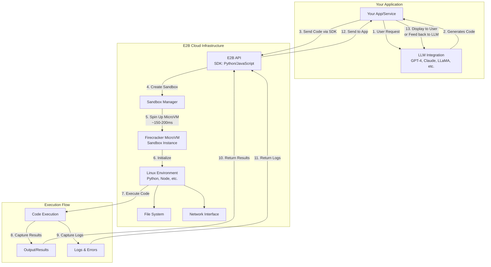

# e2b-sandbox-examples

Lightweight example scripts and notebooks that demonstrate how to use an E2B-style sandbox (Python SDK) to generate and execute code safely in isolated environments.

**Quick overview**

- **What this repo contains:** a set of small example scripts that create, connect to, run code inside, and stop an E2B sandbox. Notebooks (.ipynb) versions of each script are also included for interactive use.
- **Intended audience:** developers experimenting with remote sandboxed code execution or building LLM-driven developer tools.

**Suggested repository name (recommended):** `e2b-sandbox-examples`

Alternative names:
- `e2b-python-sandbox`
- `e2b-code-interpreter-demos`

**Prerequisites**

- Python 3.8+ installed
- `OPENAI_API_KEY` and `E2B_API_KEY` set in your environment if you plan to run the LLM + sandbox scripts
- Optional: `minikube`, `docker` or other local infra if you want to run a local Kubernetes cluster — not required for these examples

Export environment variables (zsh):

```bash
export OPENAI_API_KEY="sk-..."
export E2B_API_KEY="e2b-..."
```

**Quickstart — run a script**

1. (Optional) Create and activate a virtual environment:

```bash
python3 -m venv .venv
source .venv/bin/activate
```

2. Install dependencies (if you have a `requirements.txt` in your project — otherwise install what you need):

```bash
# Example (adjust packages as necessary)
pip install openai pandas
```

3. Run a script, for example:

```bash
python3 basic_sandbox.py
```

Or run the interactive notebook using Jupyter:

```bash
pip install jupyterlab
jupyter lab
```

Open the corresponding `.ipynb` file in Jupyter and execute cells.

**Files in this repository**

- `basic_sandbox.py` / `basic_sandbox.ipynb`: minimal example that creates a sandbox and runs a couple of simple statements.
- `start_sandbox.py` / `start_sandbox.ipynb`: create a sandbox and save its ID to `sandbox_id.txt` for other scripts to connect.
- `run_code_in_existing_sandbox.py` / `run_code_in_existing_sandbox.ipynb`: connect to an existing sandbox (reads `sandbox_id.txt`) and run code.
- `stop_sandbox.py` / `stop_sandbox.ipynb`: connect to the sandbox and kill it.
- `data_analyst_e2b.py` / `data_analyst_e2b.ipynb`: example that uploads `sales.csv` to the sandbox, installs `pandas`, and runs a small analysis.
- `llm_e2b_simple.py` / `llm_e2b_simple.ipynb`: demonstrate asking an LLM for Python code and running it inside the sandbox.
- `sales.csv`: sample data used by `data_analyst_e2b.py`.

**Usage notes & troubleshooting**

- If `kubectl` or local cluster connectivity is required by your environment, ensure your cluster is running — common error is `The connection to the server ... was refused` when no cluster is available.
- If a script reports a missing `sandbox_id.txt`, run `start_sandbox.py` first and keep it running while others connect (or manually create the file with a valid ID).
- When running LLM-driven examples, be mindful of costs and the model settings in the script.

**Contributing**

Contributions welcome. Open an issue or PR with improvements, clearer docs, or more examples (e.g., notebook splitting, tests, CI).

**License**

Choose and add a license (MIT recommended for examples). To add MIT, create a `LICENSE` file with the MIT text.

**Contact**

Open issues in this repository or contact the maintainer in the repo metadata.

---

_Converted: example scripts and corresponding notebooks included in the same folder for ease of use._

